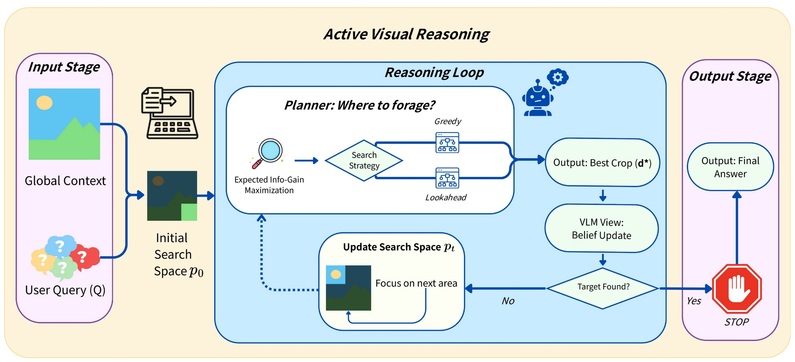
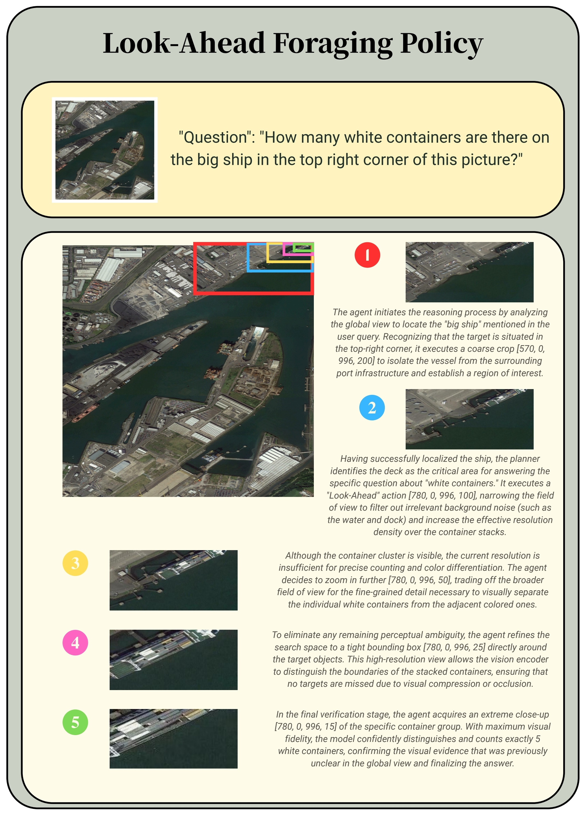
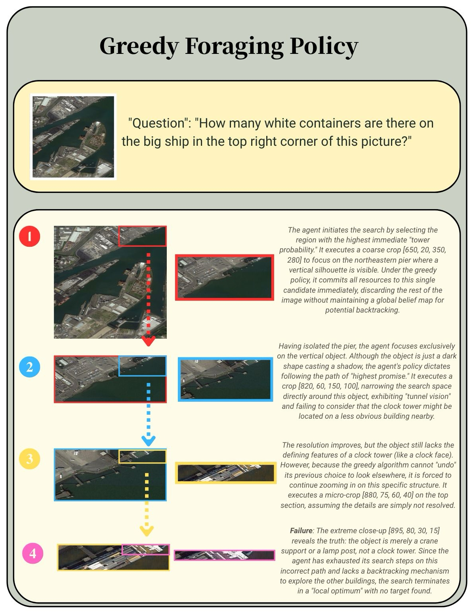

<div align="center">

# The Perceptual Bandwidth Bottleneck in Vision-Language Models<br/>Active Visual Reasoning via Sequential Experimental Design

### Teaching VLMs to actively *look* — not just passively see.

[](https://arxiv.org/abs/2605.01345)
[](https://icml.cc)
[](LICENSE)
[]()

</div>

---

## Abstract

Visual perception in modern Vision-Language Models (VLMs) is constrained by a **perceptual bandwidth bottleneck**: a broad field of view preserves global context but sacrifices the fine-grained details required for complex reasoning. We argue that high-resolution visual reasoning is therefore not only semantic reasoning but also task-relevant evidence acquisition under limited perceptual bandwidth.

Inspired by active vision and information foraging, we formalise this process as **Sequential Bayesian Optimal Experimental Design (S-BOED)**, where an agent decides which visual evidence to acquire before answering. Since exact Bayesian inference is intractable in continuous gigapixel spaces, we derive a tractable **coverage–resolution objective** as a proxy for task-relevant information gain.

We instantiate this framework with **FOVEA**, a training-free procedure that refines VLM crop proposals through evidence-oriented probing. Experiments on high-resolution benchmarks show consistent gains over direct and ReAct-style baselines, with particularly strong improvements in search-dominated remote-sensing settings.

---

## Framework

<p align="center">
  
</p>

Given a global image and a query, the agent iteratively optimises its foveation crop **d** by maximising **Expected Information Gain (EIG)**. The reasoning loop continues by implicitly updating the search space *p<sub>t</sub>* through interaction history until the semantic target is resolved.

---

## Headline Results

> **An open-source 30B backbone with S-BOED matches the proprietary Gemini 2.5 Flash on high-resolution visual reasoning — without a single line of training.**

| Method                         | Backbone                       | Mean (4 benchmarks) |
|--------------------------------|--------------------------------|--------------------:|
| Qwen3-Base (direct)            | Qwen3-VL-30B-A3B-Instruct      | 73.3%               |
| ReAct agent                    | Qwen3-VL-30B-A3B-Instruct      | 75.1%               |
| RAP                            | Qwen3-VL-30B-A3B-Instruct      | 71.9%               |
| Thyme (RL-based)               | Qwen-2.5-VL-7B                 | 73.0%               |
| GPT-5                          | proprietary                    | 74.1%               |
| Gemini 2.5 Flash               | proprietary                    | 78.0%               |
| **S-BOED (ours)**              | **Qwen3-VL-30B-A3B-Instruct**  | **77.7%**           |

Mean across HR-Bench 4K/8K, MME-RealWorld-Lite, V*Bench, and CV-Bench.

**Closing the gap to a Human-annotated Oracle on remote sensing**:

| Strategy        | Accuracy |
|-----------------|---------:|
| Base (no search)| 38.4%    |
| ReAct           | 45.1%    |
| Naive Sampling  | 47.6%    |
| MCMC            | 49.1%    |
| **Look-ahead (ours)** | **54.7%** |
| *Human Oracle*  | *68.0%*  |

Look-ahead reduces the gap to Oracle to **~13 pp**. The remaining error is no longer "didn't find it" — it's "found it but misjudged."

---

## Case Study: Look-ahead vs. Greedy

> *"How many white containers are on the large ship in the upper-right?"*

<table>
<tr>
<td width="50%" align="center">
<b>Look-ahead (ours)</b><br/>
<i>5-step coarse-to-fine foveation</i><br/>

</td>
<td width="50%" align="center">
<b>Greedy baseline</b><br/>
<i>Tunnel vision into the wrong region</i><br/>

</td>
</tr>
</table>

Look-ahead aggregates information across multiple crops to cross the **Information Cliff** — the super-additivity property of visual information that makes greedy provably insufficient:

<p align="center">
  <em>I(y; z<sub>wide</sub>, z<sub>zoom</sub>)  ≫  I(y; z<sub>wide</sub>) + I(y; z<sub>zoom</sub>)</em>
</p>

A wide view alone has too low resolution; a random zoom alone misses the target. Each yields near-zero gain; together they explode.

---

## Code Overview

This repository contains the public implementation for config-driven active reasoning agents for vision-language benchmark evaluation. The code builds LangGraph workflows from YAML configs and runs variants that improve cropping decisions with sequential experimental design.

The main public entrypoint is:

```bash
uv run -m cv_agent.main_benchmark_multi <config.yaml>
```

Included Configs:
- `configs/boed-full.yaml`: primary full benchmark config running FOVEA cropping over MME, V*Bench, CV-Bench, and HR-Bench.
- `configs/lookahead-mme-remote-sensing.yaml`: look-ahead cropping policy on MME remote-sensing tasks.
- `configs/mcmc-mme-remote-sensing.yaml`: MCMC cropping policy on MME remote-sensing tasks.

For a fully self-contained dev/repro setup (MinIO + cropping MCP server on your own machine), see [`tools/local-stack/`](tools/local-stack/README.md).

## Setup

Install dependencies with `uv`:

```bash
uv sync --extra dev
```

Create a local env file from the template:

```bash
cp .env.example .env
```

Required runtime services:

- An OpenAI-compatible vision-language model endpoint.
- A cropping MCP server exposing `crop_image_tool_crop_image_post`.
- A MinIO/S3-compatible bucket for image hosting.
- Local MME and V*Bench files if running configs that reference those datasets.

Langfuse tracing is optional. If Langfuse credentials are not configured, the Langfuse client is disabled by the SDK.

## Optional Vision Tools

The public example configs keep only cropping enabled because OCR, detection, segmentation, and depth estimation require additional MCP service deployments. The code for those tools is still included and can be enabled in custom configs with tool names `ocr`, `detection`, `detection_small_object`, `segmentation`, and `depth_estimation` once you provide matching `server_url` values. The OCR wrapper defaults to `parse_pdf_file_parse_post`; set `remote_tool_name` in the tool parameters if your OCR MCP server exposes a different operation such as `ocr_image_with_mineru`.

## Environment

Core model and tool settings:

```bash
export OPENAI_BASE_URL="https://your-openai-compatible-endpoint/v1"
export OPENAI_API_KEY="your-api-key"
export CV_AGENT_MODEL="Qwen3-VL-30B-A3B-Instruct"
export CV_AGENT_CROPPING_MCP_URL="https://your-cropping-mcp-server/mcp"
```

Object storage:

```bash
export CV_AGENT_MINIO_ENDPOINT="host:port"
export CV_AGENT_MINIO_ACCESS_KEY="access-key"
export CV_AGENT_MINIO_SECRET_KEY="secret-key"
export CV_AGENT_MINIO_BUCKET="cv-agent"
export CV_AGENT_MINIO_SECURE="false"
```

Dataset paths:

```bash
export MME_DATA_PATH="/path/to/MME-RealWorld-Lite.json"
export MME_IMAGE_DIR="/path/to/mme/images"
export VSTAR_DATA_PATH="/path/to/vstar/test_questions.jsonl"
export VSTAR_IMAGE_DIR="/path/to/vstar/images"
```

Optional tracing:

```bash
export LANGFUSE_PUBLIC_KEY="..."
export LANGFUSE_SECRET_KEY="..."
export LANGFUSE_HOST="https://cloud.langfuse.com"
```

These are all included in `.env.example`. You can run with `uv run --env-file .env -m ...` to set these environment variables easily.

## Running

Run the full FOVEA benchmark:

```bash
uv run python -m cv_agent.main_benchmark_multi configs/boed-full.yaml
```

Run the MME remote-sensing variants:

```bash
uv run python -m cv_agent.main_benchmark_multi configs/lookahead-mme-remote-sensing.yaml
uv run python -m cv_agent.main_benchmark_multi configs/mcmc-mme-remote-sensing.yaml
```

Use `--set` to override config values without editing YAML:

```bash
uv run python -m cv_agent.main_benchmark_multi configs/boed-full.yaml \
  --set benchmark_concurrency=2 \
  --set benchmarks.mme.filtering.limit=10
```

Results are written under `results/multi/<timestamp>/`.

### Filtering options

```yaml
benchmarks:
  my_benchmark:
    dataset: mme
    concurrency: 2
    filtering:
      # Option 1: Specific indices
      indices: [10, 20, 30, 40, 50]
      # Option 2: Task patterns (glob-style wildcards)
      task_patterns:
        - 'Existence/*'
        - 'Counting/*'
      # Option 3: Sample N items per task (random)
      samples_per_task: 5
      # Option 4: Limit total samples
      limit: 100
      # Can combine multiple filters - they apply sequentially
```

**Filter Order:**
1. Start with `indices` (if provided) OR all indices
2. Filter by `task_patterns` (glob matching)
3. Sample `samples_per_task` (grouped by task_name)
4. Truncate with `limit`

## Development

Run local checks:

```bash
uv run ruff format
uv run ruff check .
uv run pytest -q
```

The tests are offline by default and validate config loading, registry wiring, pure policy helpers, answer grading, and storage env parsing.

## Citation

```bibtex
@misc{liu2026perceptual,
  title         = {The Perceptual Bandwidth Bottleneck in Vision-Language Models: Active Visual Reasoning via Sequential Experimental Design},
  author        = {Liu, Anjie and Gong, Ziqin and Song, Yan and Chen, Yuxiang and Liu, Xiaolong and Lu, Hengtong and Zhang, Kaike and Wei, Chen and Wang, Jun},
  year          = {2026},
  eprint        = {2605.01345},
  archivePrefix = {arXiv},
  primaryClass  = {cs.CV},
  url           = {https://arxiv.org/abs/2605.01345},
}
```

## License

This project is released under the MIT License. See `LICENSE`.

---
